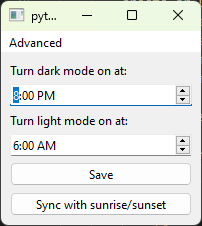

# Auto Darkmode

A PyQt6 application which uses the [task scheduler api](https://learn.microsoft.com/en-us/windows/win32/taskschd/task-scheduler-start-page) schedule a task which will automatically turn on or off darkmode on windows. You can also sync it with the sunrise/sunset in your local area using the [Sunrise Sunset](https://sunrise-sunset.org/) api.

